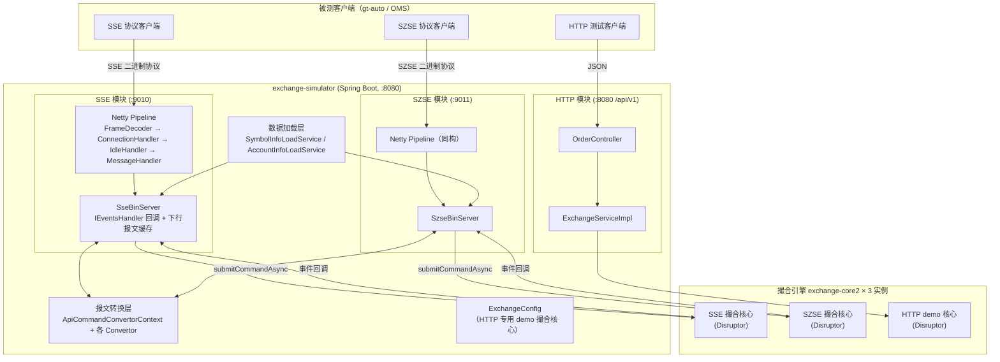
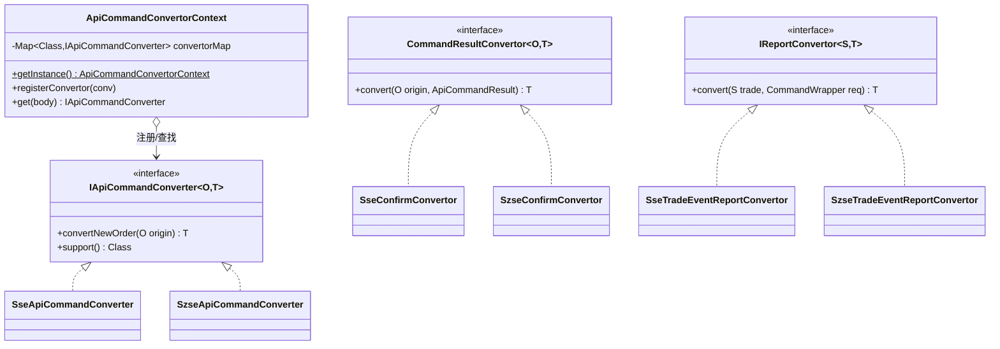
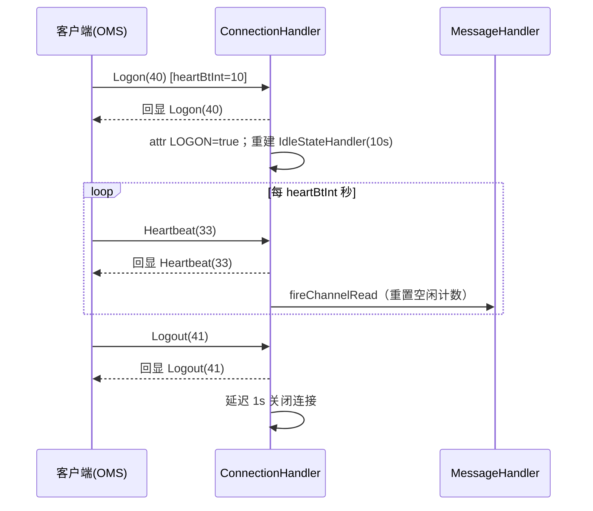
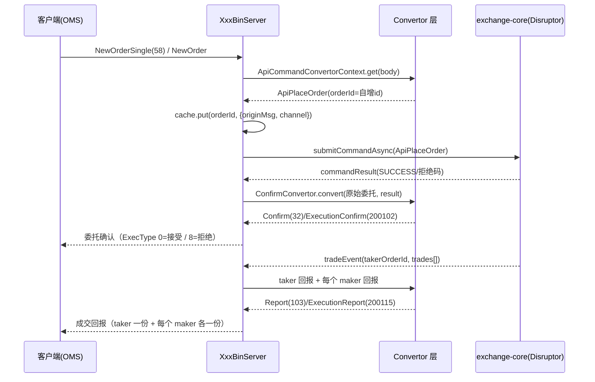
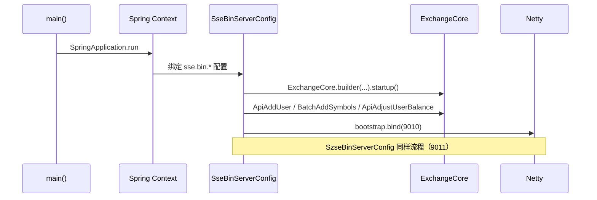

# exchange-simulator 详细设计文档

> 版本：v1.1（2026-09-19，基于 main 分支 `5bf34a1` 代码梳理；同日完成第一轮缺陷修复，见变更记录）
> 配套文档：[TODO.md](./TODO.md)（待办清单与已知问题）

---

## 0. v1.1 变更记录（2026-09-19 修复轮）

- Netty 管线顺序调整：`IdleStateHandler` 移至 ConnectionHandler **之前**，心跳空闲三振断连恢复生效（SSE/SZSE 一致）；
- 登录时以 `pipeline.replace` 重建空闲检测，重复 Logon 安全；SZSE 心跳间隔同样夹取到 [5,60] 秒；
- SZSE 心跳/业务报文增加登录校验，未登录一律断开；
- SSE 下行 MsgSeqNum 改为**按会话**（channel attr）独立自增；
- 委托确认转换器 default 分支按申报拒绝（ExecType=8）兜底下发，客户端总有回执；
- `tradeEvent` 对 cache 未命中的 taker/maker 判空跳过；cache 增加三条清理路径（拒绝/全部成交/断连）；
- Netty 端口绑定、CSV 数据加载改为 fail-fast；
- HTTP 参数校验修复为 javax.validation 系并真正生效；reservePrice 缺省回落到委托价；orderId 限定数字；
- 新增 `common` 公共包（Constant/CommandWrapper/ExecType/HeartBtIntUtil）与 `szse.SzseMsgType` 常量，消除 szse→sse 反向依赖；
- 新增 38 个单元测试与 Dockerfile（JDK 8 运行时）。

## 1. 概述

### 1.1 项目定位

exchange-simulator 是一个**交易所撮合模拟器**，用于在测试环境中模拟：

- **上交所（SSE）** 券商/会员网关的二进制交易接口；
- **深交所（SZSE）** 券商网关的二进制交易接口；
- 一个简化版的 **HTTP 下单接口**（内部测试用途）。

它的核心用途是作为 OMS / 交易客户端（如 [gt-auto](https://github.com/xinchentechnote/gt-auto) 自动化测试工具）的**对手方环境**，支撑协议层的联通性与业务回归测试（见 `autotest.sh` 与 `testcase/`）。

撮合能力由开源库 **[exchange-core2](https://github.com/exchange-core/xchange-core) 0.5.3**（LMAX Disruptor 架构的内存撮合引擎）提供，本工程在其外层完成三件事：

1. **协议接入**：基于 Netty 实现 SSE / SZSE 二进制协议的 TCP 服务端（登录、心跳、报文编解码）；
2. **报文转换**：在「交易所协议报文」与「exchange-core 的 ApiCommand / 事件回调」之间双向转换；
3. **市场初始化**：从 CSV 加载证券（symbol）与账户（account）基础数据，注册到撮合核心。

### 1.2 术语

| 术语 | 含义 |
| --- | --- |
| OMS | 订单管理系统，即本模拟器的客户端（被测系统） |
| 撮合核心 / exchange-core | `exchange.core2` 库提供的撮合引擎实例（含 Disruptor 线程） |
| NewOrderSingle / NewOrder | SSE / SZSE 的新订单委托报文 |
| Confirm / ExecutionConfirm | SSE / SZSE 的委托确认报文（交易所收到并接受/拒绝委托） |
| Report / ExecutionReport | SSE / SZSE 的成交回报报文 |
| taker / maker | 主动成交单 / 被动挂单（吃单方与挂单方） |
| PBU | 参与者交易业务单元（Participant Business Unit） |

### 1.3 运行环境

| 项 | 值 | 说明 |
| --- | --- | --- |
| JDK | **必须 Java 8**（运行时） | exchange-core 0.5.3 依赖 chronicle-bytes 2.19.1，在 JDK 11+ 上无法启动（详见 TODO P0-1） |
| 构建工具 | Maven | `mvn package` 产出可执行 fat jar |
| 框架 | Spring Boot 2.7.0 | Web 容器 Tomcat，端口 8080 |
| 依赖 | Netty 4.1.100、Guava 33.5、fastjson 2.0.23、Lombok、finproto（sse-bin / szse-bin 1.0.0）、spring-boot-starter-validation（javax.validation 系） | finproto 提供协议报文的编解码模型 |

---

## 2. 总体架构

### 2.1 架构图



### 2.2 关键设计决策

1. **每个协议市场一个独立的撮合核心**：`SseBinServerConfig` 与 `SzseBinServerConfig` 各自构建一个 `ExchangeCore`（Disruptor 实例）并互不共享，天然实现市场隔离（证券代码、账户体系独立）。
   - 注意：目前**存在第三个撮合核心**——`ExchangeConfig#exchangeApi()`，它为 HTTP 接口服务，内置了硬编码的演示数据（uid 1001/1002、symbol 10086），与两个协议市场**不互通**（已知问题，见 TODO P1-12）。
2. **报文转换采用注册表模式**：`ApiCommandConvertorContext` 是全局单例，按「报文 body 的 Class」注册/查找转换器，SSE 与 SZSE 各注册一个新订单转换器（`SseApiCommandConverter` / `SzseApiCommandConverter`），新增报文类型只需扩展转换器。
3. **上行异步、下行回调**：上行 `submitCommandAsync` 非阻塞提交；下行依赖 exchange-core 的 `IEventsHandler` 回调（`commandResult` / `tradeEvent` / `rejectEvent` / `reduceEvent` / `orderBook`），在回调里完成「事件 → 协议报文」转换并回写 Netty channel。
4. **原报文缓存（cache）**：`SseBinServer` / `SzseBinServer` 各持有一个 `ConcurrentHashMap<Long, CommandWrapper>`，以内部 orderId 为 key 缓存「原始委托报文 + 客户端 channel」。因为 exchange-core 的回调事件里只有 orderId 等撮合侧字段，回填协议报文的账号/营业部等字段必须回查原始委托。缓存清理路径：申报被拒（确认 ExecType=8 后移除）、taker 全部成交（takeOrderCompleted）、连接断开（按会话批量清理）。
5. **内部订单号全局自增**：`GlobalUniqueId`（AtomicLong 从 1 开始）同时用于 orderId 与资金调整的 transactionId；SSE 委托的 `securityId`（如 600000）直接映射为 exchange-core 的 `symbolId`，`account` 映射为 `uid`。
6. **下行消息序号按会话独立**：SSE 下行 MsgSeqNum 存于 channel attr（`Constant.MSG_SEQ_NUM`），每个会话内单调递增、互不影响。

### 2.3 线程模型

| 线程 | 职责 |
| --- | --- |
| Netty boss（×1）/ worker（×2） | 每个协议服务各一组；连接读写、编解码、`onMessage` 提单 |
| Disruptor 撮合线程（每核心 2 个：RiskEngine + MatchingEngine） | 撮合、产生事件 |
| SimpleEventsProcessor 线程（每核心 1 个） | 消费撮合结果，回调 `IEventsHandler` → 编码下行报文 → `writeAndFlush` |
| Tomcat http-nio 线程 | HTTP 接口 |

线程安全要点：`cache` 为 ConcurrentHashMap；Netty `writeAndFlush` 线程安全；SSE 下行 MsgSeqNum 为每会话一个 AtomicLong（channel attr）。

---

## 3. 模块详细设计

### 3.1 包结构与职责

```
com.xinchentechnote.exchange.simulator
├── ExchangeSimulatorApplication   # Spring Boot 启动类
├── ExchangeConfig                 # HTTP 专用 demo 撮合核心（硬编码演示数据）
├── GlobalUniqueId                 # 全局自增 ID（orderId / transactionId）
├── SerialUID                      # HTTP DTO 的 serialVersionUID 常量
├── common/                        # SSE/SZSE 公共组件（消除跨市场反向依赖）
│   ├── Constant                   # pipeline 名称、LOGON/MSG_SEQ_NUM channel attr
│   ├── CommandWrapper             # 委托上下文（原始报文 + 来源连接）
│   ├── ExecType                   # ExecType/OrdStatus 常量（0/4/8/F）
│   └── HeartBtIntUtil             # 心跳间隔夹取 [5,60] 秒
├── sse/                           # SSE 协议模块
│   ├── SseBinServerConfig         # 配置绑定 + Bean 装配（构建撮合核心、启动服务）
│   ├── SseBinMatcherConfig        # sse.bin.matcher.* 配置（CSV 路径）
│   ├── SseBinServer               # 核心服务：会话下行缓存 + IEventsHandler 实现
│   ├── SseBinServerInitializer    # Netty pipeline 组装
│   ├── SseBinServerConnectionHandler  # 登录/登出/心跳会话层处理（含空闲三振断连）
│   ├── SseBinServerMessageHandler     # 业务报文分发（过滤心跳、断连清理缓存）
│   ├── cmd/SseApiCommandConverter     # 委托报文 → ApiPlaceOrder
│   ├── confirm/SseConfirmConvertor    # ApiCommandResult → Confirm(32)
│   └── trade/SseTradeReportConvertor 等  # TradeEvent/Trade → Report(103)
├── szse/                          # SZSE 协议模块（与 sse 同构）
│   ├── SzseBinServerConfig / SzseBinMatcherConfig / SzseBinServer
│   ├── SzseBinServerInitializer / SzseBinServerConnectionHandler / SzseBinServerMessageHandler
│   ├── SzseMsgType                # SZSE 消息类型常量（3/200102/200115）
│   ├── cmd/SzseApiCommandConverter        # NewOrder → ApiPlaceOrder
│   ├── confirm/SzseConfirmConvertor       # → ExecutionConfirm(200102)
│   └── trade/SzseTradeEventReportConvertor 等  # → ExecutionReport(200115)
├── convertor/                     # 转换层抽象
│   ├── cmd/IApiCommandConverter + ApiCommandConvertorContext
│   ├── trade/IReportConvertor
│   └── CommandResultConvertor
├── loaddata/                      # CSV 数据加载（fail-fast）
│   ├── IDataLoadService / SymbolInfoLoadService / AccountInfoLoadService
├── http/                          # HTTP 模块
│   └── OrderController / ExchangeService(Impl) / OrderRequest / OrderResponse / OrderResult
└── utils/NettyLoggingUtil         # Netty 报文日志开关（环境变量/系统属性）
```

### 3.2 协议接入层（SSE / SZSE）

两个市场共享同一套处理骨架，仅帧格式与报文类型不同：

#### 3.2.1 Netty Pipeline

```
LoggingHandler（可选，由 NettyLoggingUtil 控制）
→ LengthFieldBasedFrameDecoder（拆帧）
→ IdleStateHandler（读空闲检测，必须位于 ConnectionHandler 之前）
→ XxxBinServerConnectionHandler（会话层：登录/登出/心跳、空闲三振断连）
→ XxxBinServerMessageHandler（业务分发 → server.onMessage；断连清理缓存）
```

#### 3.2.2 帧格式与拆帧参数

| 参数 | SSE | SZSE |
| --- | --- | --- |
| 报文头 | MsgType(4B) + MsgSeqNum(8B) + MsgBodyLen(4B) = 16B | MsgType(4B) + MsgBodyLen(4B) = 8B |
| 校验和 | 尾部 4B | 尾部 4B |
| lengthFieldOffset | 12 | 4 |
| lengthFieldLength | 4 | 4 |
| lengthAdjustment | 4（补偿 checksum） | 4 |
| initialBytesToStrip | 0（整帧透传给 SseBinary/SzseBinary 解码） | 0 |
| 最大帧长 | 1MB | 1MB |

#### 3.2.3 会话状态机（ConnectionHandler）

```
[已连接] --Logon--> 回显 Logon 报文
                     设置 channel attr LOGON=true
                     以 pipeline.replace 重建 IdleStateHandler（协商间隔夹取到 [5,60] 秒；重复 Logon 安全）
         --Heartbeat--> 已登录：回显心跳（同时向下游转发用于重置空闲计数）；未登录：断开
         --Logout--> 已登录：回显并延迟 1s 关闭连接；未登录：断开
         --其他业务报文--> 未登录则直接断开；已登录则向下游转发
         --读空闲--> 连续 3 次空闲事件（期间无任何报文）断开连接
```

- SSE 与 SZSE 侧所有非登录报文均做登录校验，未登录一律断开。
- 空闲检测基于 IdleStateHandler 的读空闲事件，计数在收到任何报文时重置；三振断连逻辑位于 ConnectionHandler（事件由其上游的 IdleStateHandler 触发，管线顺序有单元测试防回归）。

#### 3.2.4 报文类型

SSE（`SseBinary.BodyMessageFactory.MessageType`）：

| MsgType | 报文 | 方向 | 当前支持 |
| --- | --- | --- | --- |
| 33 | HEARTBEAT | 双向 | ✅ 回显 |
| 40 | LOGON | 双向 | ✅ 回显 |
| 41 | LOGOUT | 双向 | ✅ 回显 |
| 58 | NEW_ORDER_SINGLE | C→S | ✅ 转换下单 |
| 61 | ORDER_CANCEL | C→S | ❌ 未实现 |
| 32 | CONFIRM | S→C | ✅ 委托确认 |
| 103 | REPORT | S→C | ✅ 成交回报 |
| 59/204 | CANCEL_REJECT / ORDER_REJECT | S→C | ❌ 未实现 |

SZSE（库中无枚举，代码中为硬编码魔数）：

| MsgType | 报文 | 方向 | 当前支持 |
| --- | --- | --- | --- |
| 3 | Heartbeat | 双向 | ✅ 回显 |
| — | Logon / Logout | 双向 | ✅ 回显 |
| — | NewOrder | C→S | ✅ 转换下单 |
| — | OrderCancelRequest | C→S | ❌ 未实现 |
| 200102 | ExecutionConfirm（Extend200102） | S→C | ✅ 委托确认 |
| 200115 | ExecutionReport（Extend200115） | S→C | ✅ 成交回报 |
| — | BusinessReject / CancelReject | S→C | ❌ 未实现 |

### 3.3 报文转换层



#### 3.3.1 上行：委托报文 → ApiPlaceOrder

`SseApiCommandConverter`（`NewOrderSingle`）与 `SzseApiCommandConverter`（`NewOrder`）的映射规则一致：

| 协议字段 | ApiPlaceOrder 字段 | 规则 |
| --- | --- | --- |
| — | orderId | `GlobalUniqueId.getAndIncrement()`（服务端生成） |
| SecurityId | symbol | `Integer.parseInt`（证券代码即 symbolId） |
| Account / AccountId | uid | `Long.parseLong` |
| Side | action | `"1"` → BID（买），否则 ASK（卖） |
| — | orderType | 固定 `OrderType.GTC`（未解析协议的 OrdType/TimeInForce） |
| Price | price / reservePrice | 二者均填委托价 |
| OrderQty | size | 原样 |

#### 3.3.2 下行：撮合事件 → 协议报文

- `commandResult`（委托确认）：
  - `SUCCESS` → ExecType `0`（申报成功）；
  - `RISK_NSF` / `RISK_MARGIN_TRADING_DISABLED` / `RISK_INVALID_RESERVE_BID_PRICE` / `RISK_ASK_PRICE_LOWER_THAN_FEE` / `USER_MGMT_USER_NOT_FOUND` → ExecType `8`（申报拒绝）；
  - 其他结果码 → **同样按 ExecType `8` 兜底下发**，保证客户端总能收到回执。
- `tradeEvent`（成交回报）：
  - 先为 **taker** 生成一份回报（SSE: Report(103) / SZSE: ExecutionReport(200115)），ExecType=`F`；cache 未命中则记 warn 跳过；
  - 再遍历 `trades` 列表，为每个 **maker** 各生成一份回报（未命中同样跳过）；
  - 回报中的账号、证券、营业部等字段从 cache 中的原始委托报文回填。

### 3.4 撮合核心层（exchange-core 封装）

每个市场的装配流程（`SseBinServerConfig#sseBinServer()`，SZSE 同构）：

1. `new SseBinServer(port)`；
2. `creatExchangeApi(server)`：`SimpleEventsProcessor(server 作为 IEventsHandler)` + 默认 `ExchangeConfiguration` → 构建 `ExchangeCore` → `startup()`（启动 Disruptor）→ 取 `ExchangeApi`；
3. `initBaseInfo(api)`：加载 CSV → 注册用户（`ApiAddUser`）→ 注册证券（`BatchAddSymbolsCommand`）→ 注入资金（`ApiAdjustUserBalance`，transactionId 取自 `GlobalUniqueId`）；
4. `server.start()`：Netty 绑定端口（`bind().sync()`，**绑定失败抛异常终止启动**）。

事件回调处理矩阵：

| 事件 | SSE 处理 | SZSE 处理 |
| --- | --- | --- |
| commandResult | ApiPlaceOrder → Confirm(32) 下发 | → ExecutionConfirm(200102) 下发 |
| tradeEvent | taker + 每个 maker 各一份 Report(103) | taker + 每个 maker 各一份 ExecutionReport(200115) |
| rejectEvent | 仅日志（未实现回执） | 仅日志 |
| reduceEvent | 仅日志（未实现） | 仅日志 |
| orderBook | 仅日志（未实现行情发布） | 仅日志 |

### 3.5 数据加载层

CSV 首行为表头（跳过），支持 `#` 与 `//` 注释行。

`data/{sse,szse}/symbol_data.csv`（10 列，对应 `CoreSymbolSpecification`）：

```
symbolId,type,baseCurrency,quoteCurrency,baseScaleK,quoteScaleK,takerFee,makerFee,marginBuy,marginSell
600000,0,840,840,100,1,3,2,0,0
```

- type：0=现货证券（SymbolType.of），1=期货（示例已注释），2=基金/期权类；
- 货币代码 840 为账户本位币；ETF（510050 等）使用独立的 baseCurrency（156002…）以隔离申购份额。

`data/{sse,szse}/account_data.csv`（3 列）：

```
uid,currency,amount
10001,840,1000000
```

> 数据加载为 fail-fast：文件缺失、列数不足、解析异常都会抛 `IllegalStateException` 终止启动（含文件与行号信息）。

### 3.6 HTTP 模块

| 接口 | 说明 |
| --- | --- |
| `POST /api/v1/orders/place` | 提交委托（JSON），异步提交到 demo 撮合核心，恒返回 `true`（异常时 `false`） |
| `GET /api/v1/orders/health` | 健康检查 |

请求体 `OrderRequest`：orderId(String，须为数字)、userId、action(BID/ASK)、orderType、price、size、symbol、reservePrice（可选，缺省回落到 price）。

> 已知问题（均已修复，保留记录）：
> - 参数校验此前因 jakarta/javax 混用而完全失效，现已切换为 `spring-boot-starter-validation`（javax 系）并真实生效（非法请求返回 400）；
> - 接口语义为**异步受理**（提交成功即返回 true），订单确认/成交由撮合事件回调输出到日志；同步等待订单状态与 `OrderResponse`/`OrderResult` 接入见 TODO P2-19；
> - HTTP 模块使用独立的 demo 撮合核心，与协议市场不互通（TODO P1-12）。

### 3.7 公共组件

- **GlobalUniqueId**：静态 AtomicLong，从 1 自增；服务重启后从 1 重新开始（无持久化）。
- **NettyLoggingUtil**：优先读环境变量 `NETTY_LOGGING_ENABLED` / `NETTY_LOGGING_LEVEL` / `NETTY_LOGGING_HANDLER_NAME`，其次系统属性 `netty.logging.*`，默认关闭。
- **HeartBtIntUtil**：心跳间隔夹取到 [5, 60] 秒。
- **CommandWrapper**：`uniqueId(orderId) + channel + originMsg(原始协议报文) + apiCommand`。

---

## 4. 关键流程时序

### 4.1 登录与心跳（SSE，SZSE 同构）



### 4.2 委托下单（含确认与成交）



### 4.3 启动流程



---

## 5. 配置参考

`src/main/resources/application.properties`：

| 配置项 | 默认值 | 说明 |
| --- | --- | --- |
| `sse.bin.server.port` | 9010 | SSE 协议服务监听端口 |
| `sse.bin.matcher.symbolInfoPath` | data/sse/symbol_data.csv | SSE 证券数据 CSV |
| `sse.bin.matcher.accountInfoPath` | data/sse/account_data.csv | SSE 账户数据 CSV |
| `szse.bin.server.port` | 9011 | SZSE 协议服务监听端口 |
| `szse.bin.matcher.symbolInfoPath` | data/szse/symbol_data.csv | SZSE 证券数据 CSV |
| `szse.bin.matcher.accountInfoPath` | data/szse/account_data.csv | SZSE 账户数据 CSV |
| `server.port` | 8080 | Spring Boot HTTP 端口（未显式配置） |
| `logging.level.root` | INFO | 打开 debug 可见报文日志（注释中有示例） |

环境变量（Netty 字节码日志，默认关闭）：`NETTY_LOGGING_ENABLED` / `NETTY_LOGGING_LEVEL` / `NETTY_LOGGING_HANDLER_NAME`（或系统属性 `netty.logging.*`）。

---

## 6. 构建与运行

```shell
# 单元测试（任意 JDK，38 个用例）
mvn test

# 构建（需 JDK 8 运行时，构建产物为可执行 fat jar）
mvn clean package -DskipTests

# 运行（必须在 JDK 8 下；JDK 11+ 会因 chronicle 兼容性启动失败）
java -jar target/exchange-simulator-1.0-SNAPSHOT.jar

# Docker（内置 JDK 8 运行时，规避本机 JDK 版本问题）
docker build -t exchange-simulator .
docker run --rm -p 8080:8080 -p 9010:9010 -p 9011:9011 exchange-simulator

# SSE 自动化回归（依赖 gt-auto 工具，见 readme；应用启动后执行）
./autotest.sh
```

自动化测试用例（`testcase/sse/`）：

- `gw-auto-sse.toml`：gt-auto 模拟器配置（oms 类型，连接 localhost:9010，binary-sse 协议）；
- `sse_test_case.csv`：用例编排，列为 `case_id, case_title, step_id, sleep_ms, step_desc, action_type(Send/Receive), verify_required(Y/N), test_tool, msg_type, test_data`；
- `sse_{40,58,32,103}.csv`：各 MsgType 的报文字段模板（gt-auto 参数化填充）。

> 目前仅有 SSE 用例，SZSE 用例与断言覆盖待补充（TODO P2-21）。

---

## 7. 已知问题与限制（摘要）

详细清单及代码位置见 [TODO.md](./TODO.md)。2026-09-19 修复轮后仍开放的问题：

1. **运行时仅支持 JDK 8**（chronicle 依赖无升级路径，已通过 Dockerfile/文档固化；CI 待跟进）；
2. **撤单全链路未实现**（ORDER_CANCEL / CancelReject / ReduceEvent）；
3. 成交回报部分字段语义待对照协议规范核对（taker 成交价、leavesQty、ordStatus、tradeDate、CumQty 等）；
4. HTTP 模块与协议市场使用独立撮合核心（demo 数据），定位待决策；
5. maker 单部分成交期间缓存保留至断连（无终态信号，可接受残余）；
6. 无持久化：重启后订单/成交/序列号全部丢失（模拟器可接受，但需在文档层面明确）；
7. 无登录鉴权（Logon 不校验账号密码）——模拟器定位下可接受；
8. SZSE 协议回归用例与 CI 流水线待补充。

已修复项（心跳死代码、NPE、校验失效、fail-fast、缓存泄漏、按会话序号等）见 [TODO.md](./TODO.md) 的修复记录。
